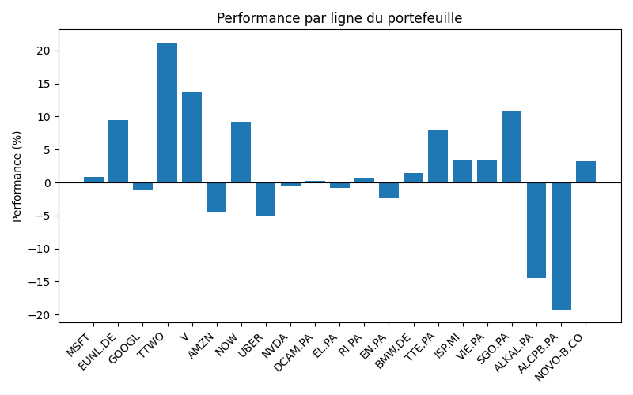
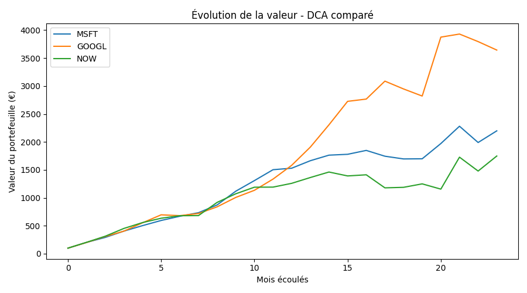

# Portfolio Tracker

Un ensemble d'outils en ligne de commande pour suivre un portefeuille d'investissement (PEA + CTO) et simuler des stratégies d'investissement, avec récupération des cours en direct.

## Fonctionnalités

### `tracker.py` — Suivi du portefeuille
- Lecture d'un portefeuille depuis un fichier CSV (ticker, PRU, quantité, compte, devise)
- Récupération des cours actuels via Yahoo Finance (`yfinance`)
- Conversion automatique EUR/USD pour les lignes cotées en dollars
- Calcul de la valeur, de la performance (%) et de la plus/moins-value (€) par ligne
- Agrégation par enveloppe (PEA / CTO)
- Export horodaté des résultats en CSV
- Génération d'un graphique de performance par ligne
- Gestion des erreurs : un ticker invalide ou indisponible n'interrompt pas l'exécution



### `dca_simulator.py` — Simulateur d'investissement programmé (DCA)
- Simulation d'un investissement mensuel fixe sur un ou plusieurs tickers
- Comparaison de plusieurs tickers entre eux
- Comparaison DCA vs investissement unique en une seule fois
- Graphique de l'évolution de la valeur du portefeuille dans le temps



## Installation

1. Cloner le dépôt :
```bash
   git clone https://github.com/King-Chr1s/portfolio-tracker.git
   cd portfolio-tracker
```

2. Installer les dépendances :
```bash
   pip3 install -r requirements.txt
```

## Utilisation

### Suivre son portefeuille

1. Renseigner son portefeuille dans `portefeuille.csv`, au format :2. Lancer le tracker :
```bash
   python3 tracker.py
```

3. Résultats produits : tableau dans le terminal, export CSV horodaté, `performance_graphique.png`

### Simuler un DCA

Modifier les tickers et le montant mensuel directement dans `dca_simulator.py` (variables `tickers_a_comparer` et `montant_mensuel`), puis lancer :
```bash
python3 dca_simulator.py
```

Résultats produits : comparaison chiffrée dans le terminal, `dca_comparaison.png`

## Structure du projet

| Fichier | Rôle |
|---|---|
| `tracker.py` | Suivi du portefeuille en direct |
| `dca_simulator.py` | Simulateur d'investissement programmé |
| `verifier_tickers.py` | Script utilitaire de validation des tickers Yahoo Finance |
| `portefeuille.csv` | Données du portefeuille (à personnaliser) |
| `requirements.txt` | Dépendances Python |
| `.gitignore` | Fichiers exclus du suivi Git (exports, cache) |

## Technologies utilisées

- Python 3.9+
- pandas (manipulation de données)
- yfinance (récupération de cours boursiers)
- matplotlib (visualisation)

## Notes

Projet réalisé dans le cadre d'un apprentissage progressif de Python, pandas, Git/GitHub et des bonnes pratiques de développement (gestion d'erreurs, structuration en fonctions, branches Git).


## Routine hebdomadaire recommandée

Pour garder un suivi utile dans le temps, relancer le tracker une fois par semaine :

1. Se placer dans le dossier du projet :
```bash
   cd portfolio-tracker
```

2. Lancer le tracker :
```bash
   python3 tracker.py
```

3. Consulter les résultats (au choix) :
```bash
   open rapport.html              # tableau détaillé, coloré
   open performance_graphique.png # performance par ligne
   open historique_graphique.png  # évolution de la valeur dans le temps
```

Une seule commande (`python3 tracker.py`) suffit à tout faire : récupération des cours, calculs, graphiques, export CSV, et mise à jour de l'historique.